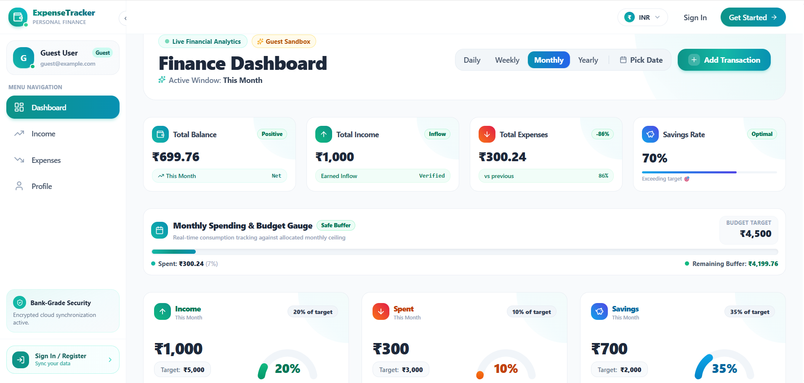

<div align="center">
  

  <br />
  <br />

  # 💳 ExpenseTracker
  ### Modern SaaS Personal Finance & Wealth Analytics Platform

  <p align="center">
    <strong>A high-performance financial command center built with the MERN stack.</strong>
  </p>

  <p align="center">
    <a href="https://aman-expensetracker.vercel.app/" target="_blank">
      
    </a>
  </p>

  <p align="center">
    
    
    
    
    
    
  </p>
</div>

---

## 🎯 Project Goal

**ExpenseTracker** eliminates the friction of manual spreadsheets by delivering an automated, visual financial cockpit.

| Core Pillar | Strategic Value |
| :--- | :--- |
| **🔍 Real-Time Clarity** | Instant visibility across all income sources, outlays, and net cashflow balance. |
| **📈 Actionable Analytics** | 24-hour hourly velocity plots, category breakdowns, and interactive donut HUD. |
| **🛡️ Budget Discipline** | Live monthly budget utilization meters with proactive spending threshold alerts. |
| **🌍 Universal Accessibility** | Multi-currency engine (`$`, `₹`, `€`, `£`) paired with a zero-friction guest sandbox. |

---

## ✨ Key Features

- 📊 **Executive Dashboard**: Dynamic KPI cards, target radial gauges, and interactive donut chart with center HUD readout.
- 📅 **Smart Date & Timeframe**: Instant 24h hourly cash velocity, interactive calendar popover, and presets (Day / Week / Month / Year).
- 💰 **Inflow & Outflow Hubs**: Categorized transaction ledgers, quick inline add/edit, and one-click Excel (`.xlsx`) export.
- 📄 **Docked Table Pagination**: Sticky footer with default 5-row view, customizable limits (5, 8, 15, 25), and square page jumps.
- 🌐 **Global Multi-Currency**: Instant switching between **USD ($)**, **INR (₹)**, **EUR (€)**, and **GBP (£)** without page reload.
- 🔐 **Security & Guest Sandbox**: Robust JWT authentication and a preloaded guest sandbox for immediate test-driving.

---

## 🛠️ Tech Stack

| Domain | Technologies |
| :--- | :--- |
| **Frontend UI** | React 19, Tailwind CSS, Lucide Icons, React Toastify |
| **Motion & Charts** | Framer Motion, Recharts (Donut HUD, Gauges, Area Charts) |
| **Backend API** | Node.js, Express.js |
| **Database & ODM** | MongoDB, Mongoose |
| **Security & Auth** | JSON Web Tokens (JWT), bcryptjs |
| **Data Export & Tooling** | ExcelJS, XLSX, Vite |

---

## 🚀 Quick Start

### 1. Backend Setup
```bash
cd backend
npm install
```
Configure `.env` in `backend/`:
```env
PORT=5000
MONGO_URI=your_mongodb_connection_string
JWT_SECRET=your_jwt_secret_key
FRONTEND_URL=https://aman-expensetracker.vercel.app
```
```bash
npm run dev
# Server running at http://localhost:5000
```

### 2. Frontend Setup
```bash
cd frontend
npm install
npm run dev
# App running at http://localhost:5173
```
*Live Production: [https://aman-expensetracker.vercel.app](https://aman-expensetracker.vercel.app)*

---

## 💡 Quick Tips

- **Guest Sandbox**: Click **"Continue to Dashboard"** on the login page to immediately test features with preloaded transactions.
- **Pick Date**: Click **"Pick Date"** in the top header card on any page to open the custom calendar popover.
- **Default Rows**: Records tables default to **5 rows** per page, adjustable via the docked footer.
- **Export**: Click **Export** on the Income or Expense pages to generate a formatted `.xlsx` report.

---

<div align="center">
  <sub>Built with ❤️ using the MERN Stack. Designed for modern personal wealth management.</sub>
</div>
